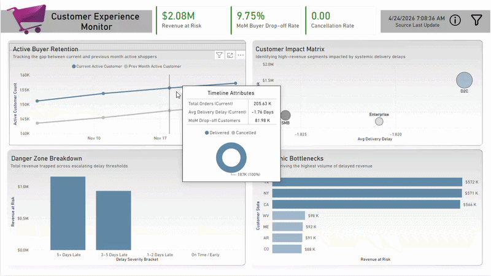
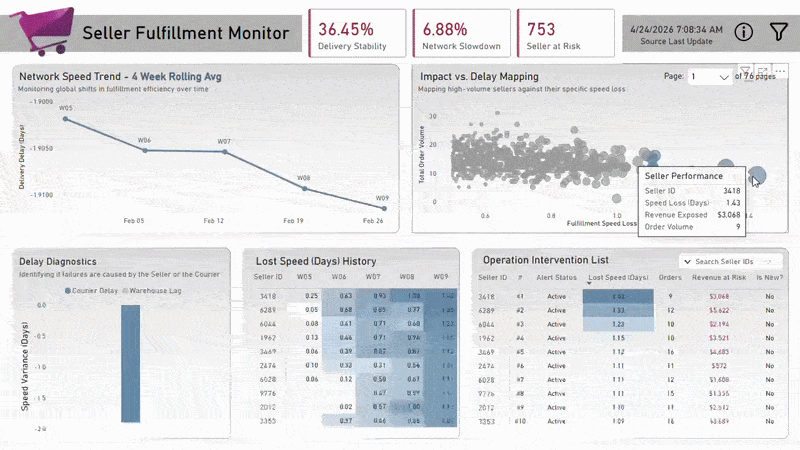
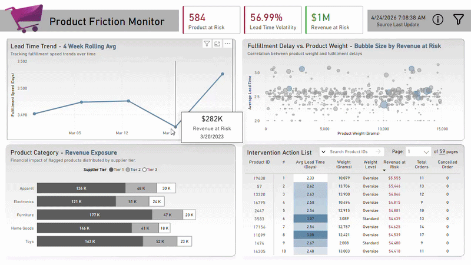

<div align="center">

[](https://github.com/BLMgithub/operations-analytics-pipeline/actions/workflows/ci-code.yml)
[](https://github.com/BLMgithub/operations-analytics-pipeline/actions/workflows/ci-infra.yml)
<br>
[](https://github.com/BLMgithub/operations-analytics-pipeline/actions/workflows/cd-pipeline.yml)
[](https://github.com/BLMgithub/operations-analytics-pipeline/actions/workflows/cd-extract.yml)

</div>

## System Design: Atomic Medallion Architecture

Event-driven medallion pipeline on Google Cloud Platform. Data moves through gated stages and reaches consumers only as one atomic release, never partial.

### Isolated Stateless Orchestration


Each run is isolated; compute state is temporary:

* **Stateless Workspace:** Deterministic `run_id` workspace, cleared immediately after completion.
* **Cloud-Native Sync:** Silver (Contract) results sync to Cloud Storage, then the local environment is purged.
* **Linear Integrity Gating:** Failure at any tier (Ingestion, Contract, Assembly) stops downstream processing. Partial or malformed data is never promoted.
* **Lazy Streaming Engine:** Polars Rust engine processes large-scale datasets within Cloud Run's serverless memory limits.

### Serverless Infrastructure & Eventarc Triggers


Serverless, decoupled, codified via Terraform:

* **Orchestrated Extraction:** Cloud Scheduler initiates daily extraction via Cloud Run, separating extraction from processing logic.
* **Event-Driven Dispatch:** Eventarc monitors Cloud Storage for `.success` flags, triggering the main job via Cloud Workflows only when extraction succeeds.
* **Zero-Trust Deployment:** GitHub Actions use Workload Identity Federation (WIF) for keyless deployments of infrastructure and containerized jobs.

## Data Defense: The Registry Rule Engine

Upstream anomalies are managed by a registry-driven validation suite:

**Bronze (Raw Snapshots)**
* Immutable snapshots of source systems. Assumed structurally untrustworthy: nulls, duplicates, orphaned records.

**Silver (The Contract Layer)**
* **Primitive Integer Pipeline:** Maps 36-byte UUID strings to 4-byte UInt32 surrogates, cutting join-key memory overhead ~16x.
* **Subtractive-Only Logic:** Never guesses or "repairs" bad data. Non-compliant records are dropped and logged in the telemetry report.
* **Cascade Cleanup:** Invalidated parent IDs propagate drops to child records (e.g., line items); orphans never reach joins.
* **Schema Enforcement:** Output strictly cast to predefined types and projected to approved columns before storage.

**Gold (The Semantic Layer)**
* **Assembly Stage:** Integrates normalized relational tables into a unified analytical dataset at a 1:1 grain per order.
* **Semantic Stage:** Transforms events into entity-centric Fact and Dimension modules (Sellers, Customers, Products).
* **Strict Grain Enforcement:** Fact tables aligned to an ISO-Week grain (`W-MON`), one row per `(Entity_ID, order_year_week)`.

### Integrity Gates & Atomic Deployment

* **Dual-Pass Validation:**
    * **Initial Raw Gate:** Tolerates structural warnings; passes them to Silver for subtractive cleanup.
    * **Post-Contract Silver Gate:** Escalates remaining warnings to fatal errors (`RuntimeError`), stopping downstream corruption.
* **Atomic BigQuery Publishing:** Authorized Views atomically swap pointers to new data versions. BI tools query complete, validated datasets with no downtime.

## Performance & Scalability

### GCP Stress-Test Metrics

| 40M Snapshot (8GB / 4 vCPU) |
| :---: |
|  |
> Benchmark data: [`40m_stats_log.csv`](assets/benchmarks/polars/)
> Dataset : [`Dataset Information`](data/)

| Metric | Data | 
|:---|:---|
| Dataset | ~40 Million Rows / ~5.3 GB Parquet |
| Provision Spec | 8 GB RAM / 4 vCPU |
| Efficiency (Processing) | ~307k Rows / Second |
| Total Runtime (Wall-Clock) | 130 Seconds |

* **Memory Density:** The Primitive Integer Pipeline shrinks join-key overhead ~16x, fitting a ~5.34GB analytical model inside the 8GB RAM limit.
* **Zero-Idle Economics:** 100% serverless execution, no billable time when idle.

### Measurement Methodology
* **Performance Profiling:** Delta between `started_at` and `completed_at` from the pipeline's native `run_duration` telemetry.
* **Memory Utilization:** [`psutil.virtual_memory().used`](assets/benchmarks/polars/) profiling verifies the resource footprint against the 8GB ceiling.

## System Health & Observability


Observability via Cloud Monitoring and Cloud Logging, codified in Terraform:

* **Pipeline Job Metrics:** Execution status (Success/Fail), workflow traffic, memory allocation against the 8GB threshold.
* **Extractor Job Metrics:** Drive API latencies and instance billable time for API usage cost tracking.
* **Automated Responders:** `CRITICAL` email alerts on ingestion failures, extractor crashes, or pipeline fatal errors (OOMs), with lineage tracking for debuggability.

## Operational Intelligence: BI Decision Support

Dashboards are built on validated, semantically flattened models.

> **Dynamic Sensitivity Calibration**
>
>Interactive "Smoke Detectors" with What-If parameters let operators adjust alert sensitivity thresholds to match changing business realities.
>
> Explore the  **[Power BI Directory](/power_bi)** to read detailed [operational guides](power_bi/docs) or download the `.pbix` [releases](power_bi/releases/).

### Customer Experience & Revenue Exposure
Correlates delivery delays with buyer drop-off rates to quantify financial risk from "cost of friction."



### Fulfillment Decision Monitor
Early-warning system on statistical deviations in network speed, not total failure, to flag partners requiring intervention.



### Product Friction Monitor
Flags structural fulfillment bottlenecks from product specifications (e.g., weight outliers) to route items to specialized freight.



## CI/CD & Security

Zero-Trust deployment model:

* **Workload Identity Federation (WIF):** Authenticates GitHub Actions to Google Cloud via short-lived OIDC tokens.
* **Infrastructure as Code:** IAM bindings and infrastructure managed via automated Terraform workflows.
* **Containerized Artifacts:** Code is packaged into Docker images and pushed to GCP Artifact Registry only after CI checks pass.

## Repository Structure

```
operations-analytics-pipeline/
├── .gcp/
│   └── terraforms/         # IaC for all GCP resources (Cloud Run, Eventarc, Storage, IAM)
├── .github/
│   └── workflows/          # CI/CD pipelines (Terraform apply, Docker build/push, Code quality & test)
├── assets/
│   └── benchmarks/         # Performance profiling logs (Pandas vs Polars memory usage)
├── data/                   # Git-ignored local directories used when simulating cloud storage
│   ├── raw/                # Extracted snapshot dumps
│   ├── contracted/         # Intermediate Silver-layer files
│   ├── published/          # Final Gold-layer analytical models
│   └── run_artifact/       # Lineage metadata and stage execution logs
├── data_extract/
│   ├── shared/             # Extractor logic and core I/O utilities
│   └── run_extract.py      # The Drive extractor orchestrator
├── data_pipeline/
│   ├── .shared/            # Storage adapters, IO wrappers, and registry configurations
│   ├── assembly/           # Delta merging and event mapping logic
│   ├── contract/           # Subtractive filtering logic (Silver Layer)
│   ├── publish/            # Manages the atomic publish lifecycle of semantic datasets
│   ├── semantic/           # Fact/Dimension table builders (Gold Layer)
│   ├── validation/         # Dual-pass structural data validation gates
│   └── run_pipeline.py     # The pipeline orchestrator and state manager
├── docs/                   # Detailed architectural and stage-level system contracts
├── runtime/                # Git-ignored ephemeral workspace used by the local pipeline executor
├── tests/                  # Pytest suite for pipeline logic and validation rules
└── power_bi/
    ├── .shared/            # Global Dashboards BI assets (e.g. Themes, .json files, etc.)
    ├── dashboards/         # Source Control (PBIP) 
    └── releases            # Deliverables (PBIX)
```
